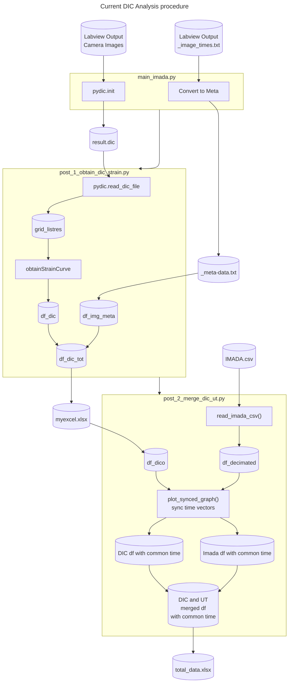

Welcome to the tension test with imada

# Workflow

1. Crop images
2. Create the "meta-info.txt" file
3. DIC Process 
4. extract the data from the "result.dic" file
5. merge DIC and Testing Machine data. 

## additional 

to prepare a video from the sequences it is possible to use Openshot. 
- import file into the project (as an image sequence)
- add the image sequence onto a track
- Export the video. 

